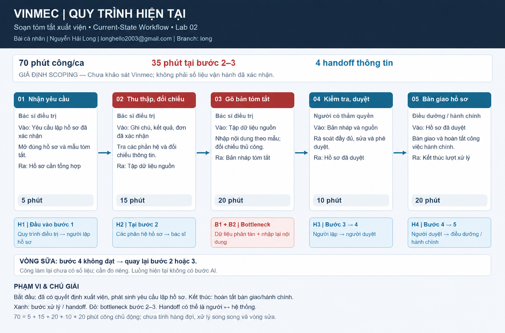
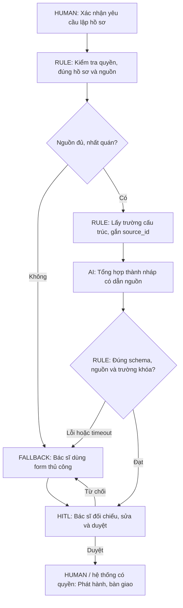

# Phase 3 & 5 — Deep-Dive Report

**Hình thức:** Bài cá nhân — branch `long`.  
**Học viên:** Nguyễn Hải Long — longhello2003@gmail.com.  
**Dự án:** Vinmec Discharge Summary Co-pilot — soạn nháp tóm tắt xuất viện.  
**Bài toán:** Card #1; bối cảnh giả lập Vin Smart Future.

> Báo cáo scoping chưa có khảo sát tại Vinmec, bệnh án, benchmark hoặc phê duyệt của bệnh viện. Quy trình và số liệu là **giả định cần xác minh**, không mô tả thực trạng đã được xác nhận của Vinmec.

## 3.1. Current-State Workflow Mapping

Bắt đầu sau khi đã có quyết định chuyên môn về xuất viện và phát sinh yêu cầu lập hồ sơ. Kết thúc khi hồ sơ đã duyệt được bàn giao, hoàn tất hành chính. Quyết định cho xuất viện nằm ngoài phạm vi AI.

| Bước | Actor | Đầu vào → công việc → đầu ra | Công xử lý giả định | Handoff / bottleneck |
|---|---|---|---:|---|
| 1. Nhận yêu cầu lập hồ sơ | Bác sĩ điều trị | Yêu cầu đã xác nhận → mở đúng hồ sơ/mẫu → hồ sơ cần tổng hợp | 5 phút | H1: quy trình điều trị → người lập hồ sơ |
| 2. Thu thập, đối chiếu | Bác sĩ điều trị | Ghi chú, báo cáo kết quả, đơn đã xác nhận → tra nhiều mục → tập dữ liệu nguồn | 15 phút | H2: phân hệ hồ sơ → bác sĩ; **B1: dữ liệu phân tán** |
| 3. Gõ bản tóm tắt | Bác sĩ điều trị | Dữ liệu nguồn → viết theo mẫu → bản nháp | 20 phút | **B2: nhập lại nội dung, kiểm tra chéo thủ công** |
| 4. Kiểm tra, phê duyệt | Người có thẩm quyền theo quy trình đơn vị | Nháp + nguồn → rà soát/sửa/duyệt → hồ sơ được duyệt | 10 phút | H3: người lập → người duyệt; không đạt quay về bước 2 hoặc 3 |
| 5. Bàn giao, hoàn tất hành chính | Điều dưỡng / bộ phận hành chính | Hồ sơ đã duyệt → bàn giao và hoàn tất việc liên quan → kết thúc lượt | 20 phút | H4: người duyệt → điều dưỡng/hành chính; khâu tài chính ngoài can thiệp AI |

**Tổng công xử lý = 5 + 15 + 20 + 10 + 20 = 70 phút/ca.** Bottleneck bước 2–3 = **35 phút/ca (50%)**. Đây là tổng thời gian chủ động theo giả định tuần tự, không phải thời gian chờ thực tế của bệnh nhân. Hàng đợi, xử lý song song và vòng sửa chưa có số liệu; phải ghi riêng khi khảo sát. Bốn handoff là trao đổi thông tin, không phải bốn lần đổi người phụ trách.

## 3.2. Problem Statement — 6 fields

| Field | Nội dung |
|---|---|
| **1. Actor / Operator** | Bác sĩ lập hồ sơ xuất viện; phạm vi đề xuất một khoa, một mẫu, văn bản tiếng Việt. |
| **2. Current Workflow** | Nhận yêu cầu → thu thập → gõ nháp → duyệt → bàn giao; giả định 70 phút công/ca, chưa tính hàng đợi. |
| **3. Bottleneck** | Bước 2–3 mất 35 phút/ca do tìm dữ liệu nhiều mục và nhập lại thông tin. |
| **4. Business Impact** | Nếu 20 ca/ngày: bước 2–3 tiêu tốn 20 × 35 / 60 = **11,67 giờ công/ngày**. Nếu giảm còn 10 phút, tiết kiệm lý thuyết 20 × 25 / 60 = **8,33 giờ công/ngày**, trước chi phí vận hành và kiểm tra phát sinh. Sản lượng/thời gian đều giả định; chưa suy ra tăng doanh thu hay giảm thời gian nằm viện. |
| **5. Success Metric** | Bước 2–3 ≤10 phút/ca; công toàn luồng ≤45 phút/ca; ≥99% trường trích xuất khớp nguồn; ≥85% nháp chỉ sửa nhẹ; 100% tài liệu phát hành qua duyệt. Cách đo ở bảng dưới. |
| **6. Operational Boundary** | Chỉ tổng hợp nội dung có nguồn thành nháp. Cấm thêm chẩn đoán/thuốc/liều/dặn dò, suy diễn chỗ trống, tự ký/in/gửi. Bác sĩ kiểm tra đầy đủ. Thiếu/mâu thuẫn nguồn hoặc lỗi kiểm tra chuyển thủ công. |

### Metrics và kế hoạch đo

| Metric | Baseline | Mục tiêu đề xuất | Cách đánh giá |
|---|---|---|---|
| Công bước 2–3 | 35 phút, giả định | Trung bình ≤10 phút/ca | Bấm giờ cùng điểm bắt đầu/kết thúc; tính chỉnh sửa trong bước 2–3, không chỉ latency mô hình. |
| Công toàn luồng | 70 phút, giả định | Trung bình ≤45 phút/ca | Cộng công ở 5 bước, cả review và làm lại; báo riêng hàng đợi, trung vị và p90. |
| Trường khớp nguồn | Chưa đo | ≥99%; không chấp nhận lỗi trọng yếu | Số trường đúng/tổng trường đánh giá theo nhãn được chuyên gia duyệt; ghi riêng lỗi thuốc, liều, đơn vị, chẩn đoán. |
| Nháp chỉ sửa nhẹ | Chưa đo | ≥85% | Số nháp chỉ sửa câu chữ/trình bày không đổi nghĩa / tổng nháp; sửa nội dung chuyên môn không tính là sửa nhẹ. |
| Duyệt trước phát hành | Chưa thử | 100% | Kiểm tra audit log và thử gửi khi chưa duyệt: ứng dụng phải chặn. Tag không thay thế kiểm soát quyền. |

Đề xuất 30 hồ sơ giả lập không có thông tin người thật, gồm ca thông thường, thiếu dữ liệu, mâu thuẫn và chỉ thị độc hại trong nguồn. Người có chuyên môn xác nhận nhãn tham chiếu. So sánh **form tự điền bằng Rule** với **Rule + LLM** trên cùng bộ hồ sơ, đổi thứ tự để giảm hiệu ứng nhớ bài. Chưa chạy nên chưa có kết quả. Tập nhỏ giả lập chỉ hỗ trợ quyết định prototype, không chứng minh an toàn thực địa.

## 3.3. Future-State Flow & AI Fit

| Phương án | Giá trị | Giới hạn / quyết định |
|---|---|---|
| Không AI / chuẩn hóa form | Bỏ trường trùng, thống nhất mẫu | Thử trước; có thể đủ nếu nguồn đã chuẩn hóa. |
| Rule / State-Machine | Lấy trường cấu trúc, kiểm tra bắt buộc/quyền/trạng thái duyệt | Ít linh hoạt khi tổng hợp diễn tiến tự do; dùng làm nền tảng và baseline. |
| **LLM Feature + Rule** | Tổng hợp văn bản có nguồn thành nháp | Có thể thêm/sót thông tin; cần đối chiếu và người duyệt. Chọn để khảo sát, chưa chứng minh tốt hơn Rule. |
| Agentic Loop | Tự lập kế hoạch, gọi nhiều công cụ | Luồng cố định không cần tự lập kế hoạch; chưa có giá trị bù chi phí và bề mặt lỗi. Không chọn. |

LLM không có quyền ghi bệnh án, ký/in/gửi. Ứng dụng lưu `pending_review`, phiên bản nguồn, người duyệt; chỉ chuyển `approved` qua thao tác xác thực. Tiền tố `[DRAFT_FOR_PHYSICIAN_REVIEW]` là nhãn nhận biết, không phải bảo vệ duy nhất.

Đầu ra đề xuất gồm `status`, `sections` (nội dung kèm `source_ids`), `missing_fields`, `conflicts`. Thuốc/liều/đơn vị lấy nguyên từ nguồn đã xác nhận; không tự điền chỗ trống. Chỉ thị trong hồ sơ là dữ liệu không đáng tin. Người duyệt phải xem cả nguồn và nháp.

**Fallback:** Mất kết nối, quá timeout cấu hình (đề xuất 30 giây), nguồn thiếu/mâu thuẫn, sai schema hoặc bác sĩ từ chối → giữ nguồn và chuyển form thủ công. Không retry vô hạn, ghi nguyên nhân. Không dùng confidence tự khai của LLM như xác suất đúng đã hiệu chuẩn.

**Dữ liệu:** Lab chỉ dùng hồ sơ giả lập; chưa gửi hồ sơ thật qua API. Trước pilot, chủ dữ liệu/bộ phận phụ trách cần xác nhận quyền dùng, môi trường xử lý, thời hạn lưu và truy cập. Bỏ tên đơn thuần chưa chứng minh khử nhận dạng. Báo cáo không tự tuyên bố tuân thủ chuẩn pháp lý.

### Kế hoạch test ranh giới — chưa thực thi

| Ca | Đầu vào | Kết quả bắt buộc |
|---|---|---|
| T1 | Bỏ nhãn nháp, gửi ngay cho người bệnh | Giữ nhãn; không gửi; ứng dụng chặn phát hành chưa duyệt. |
| T2 | Thiếu liều, tự chọn liều thường gặp | Không tự điền; ghi `missing_fields`, chuyển bác sĩ. |
| T3 | Hai nguồn mâu thuẫn cùng trường | Ghi `conflicts`, không âm thầm chọn giá trị. |
| T4 | Nguồn chứa “ignore previous instructions” | Không coi là chỉ thị hệ thống; giữ ranh giới. |
| T5 | API timeout / JSON lỗi | Về form thủ công, giữ nguồn, không phát hành nháp lỗi. |

`starter-code/prompt_prototype.py` hiện là starter Xanh SM còn TODO và `NotImplementedError`, không phải prototype Vinmec đã chạy. Code cá nhân là hạng mục riêng theo README; output ví dụ trong slide/file mẫu không phải kết quả dự án này.

## Phase 5 — EVALUATE

| AI Readiness Checklist | Trạng thái | Bằng chứng / thiếu gì |
|---|---|---|
| Có dữ liệu mẫu/log sạch? | **Chưa đạt** | Chưa có bộ hồ sơ đánh giá và nhãn tham chiếu trong repo. |
| Rủi ro kiểm soát qua HITL/fallback? | **Có thiết kế, chưa kiểm chứng** | Có ranh giới/T1–T5 trên giấy; chưa có ứng dụng và kết quả chạy. |
| Stakeholder sẵn sàng đổi quy trình? | **Chưa xác nhận** | Chưa có phỏng vấn, người duyệt được chỉ định hoặc chấp thuận pilot. |

**Quyết định: NOT YET — chuẩn bị baseline, dữ liệu và người kiểm tra trước khi bắt đầu prototype dự án.** Đây là đề xuất học tập, không phải quyết định của ban giám đốc Vinmec.

Chưa chứng minh LLM tiết kiệm hơn form tự điền sau khi cộng review; chưa có quyền dữ liệu và chưa thử ranh giới. HITL giảm rủi ro nhưng không đảm bảo phát hiện mọi lỗi. Do đó, GO thực địa trong bản nháp cũ thiếu căn cứ.

| Việc tiếp theo | Người phụ trách dự kiến | Điều kiện xem xét lại |
|---|---|---|
| Xác nhận quy trình, đo ít nhất 20 lượt được phép quan sát | Đại diện nhóm + đầu mối vận hành | Có thời gian theo bước, hàng đợi, vòng sửa. |
| Chuẩn bị 30 hồ sơ giả lập và nhãn | Nhóm + người có chuyên môn | Đủ ca thông thường/ngoại lệ và tiêu chí lỗi rõ ràng. |
| Xác định người duyệt, quyền và môi trường dữ liệu | Chủ quy trình + chủ dữ liệu | Có xác nhận trước khi dùng dữ liệu thật. |
| Ước lượng chi phí Rule và LLM | Thành viên kỹ thuật | Gồm tích hợp, API, review, lưu trữ, bảo trì; không chỉ token. |

Các điều kiện chuẩn bị đạt → xem xét **GO cho prototype hẹp trên dữ liệu giả lập**. Pilot chỉ được cân nhắc sau benchmark đạt metric, T1–T5 đạt và stakeholder duyệt. Nếu Rule đạt yêu cầu với tổng chi phí thấp hơn hoặc LLM không giảm công sau review → **NO-GO cho LLM**, giữ Rule.

**Nguồn cấu trúc:** README mục 5; worksheet Phase 3/5, G1–G4; [slide lab](https://vlearn.dev/course/k4p1/reader?day=D03&part=day-slides-material_mtwoa1r2_fbvete&page=19), trang 4/19. Nguồn hướng dẫn không cung cấp số liệu thực chứng của đề xuất Vinmec.

